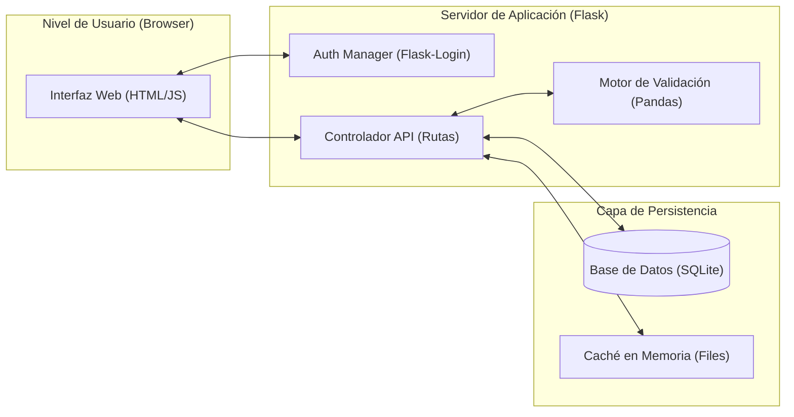
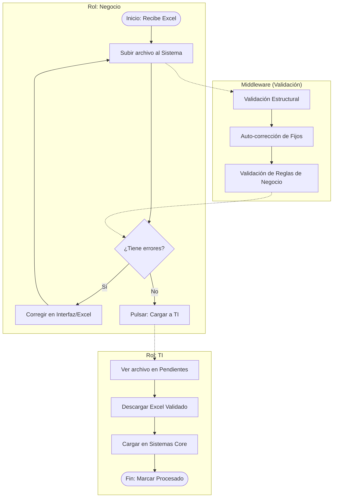
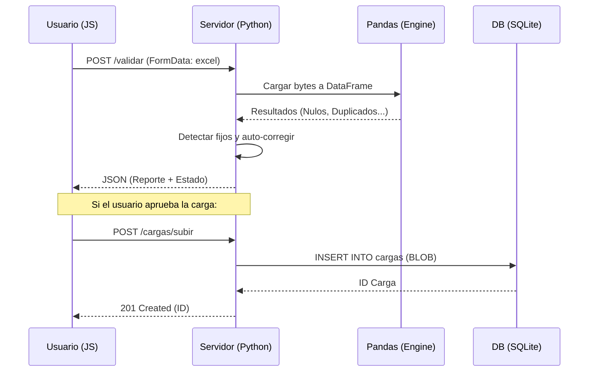

# Fastrack — Documentación Técnico-Funcional

Este documento proporciona una visión integral tanto técnica como funcional del sistema **Fastrack**, diseñado para la validación y carga de archivos Excel de precios de Movistar.

---

## 1. Objetivo del Sistema
Optimizar el proceso de carga de precios residenciales mediante un flujo de trabajo validado, eliminando errores manuales y asegurando que solo la data 100% correcta llegue a los sistemas de TI.

---

---

## 2. Visualización del Sistema (Diagramas)

### 2.1. Arquitectura de Infraestructura
Este diagrama muestra la interacción entre las capas del sistema y los componentes de procesamiento.



### 2.2. Flujo de Proceso BPMN (Negocio -> Sistema -> TI)
Representación del proceso de negocio desde la carga hasta el cierre por TI.



### 2.3. Diagrama de Secuencia de Validación
Detalle técnico de la interacción entre frontend y backend durante la validación.



---

## 3. Estructura de Proyecto (Layout Técnico)

El código sigue una estructura modular para facilitar el mantenimiento y escalabilidad:

```text
Proyecto_Fastrack/
├── app/
│   ├── auth/           # Gestión de sesiones y decoradores de rol.
│   ├── nucleo/         # Configuración del motor y lógica de base de datos.
│   ├── servicios/      # Motores de validación y auto-corrección.
│   ├── static/         # CSS, JS (app.js, panel_admin.js...) y Assets.
│   ├── templates/      # Vistas HTML (Jinja2).
│   └── servidor.py     # Controlador principal (Flask App & Routes).
├── tests/              # Suite de pruebas unitarias.
├── main.py             # Punto de entrada de la aplicación.
├── init_db.py          # Script de bootstrap para la base de datos.
└── fastrack.db         # Archivo de base de datos (SQLite).
```

---

## 3. Arquitectura de Base de Datos (DDL)

El sistema utiliza SQLite para persistencia. A continuación, la definición técnica de los esquemas:

### Esquema de Usuarios
```sql
CREATE TABLE usuarios (
    id              INTEGER PRIMARY KEY AUTOINCREMENT,
    correo          TEXT    NOT NULL UNIQUE,
    contrasena_hash TEXT    NOT NULL,
    nombre          TEXT    NOT NULL,
    rol             TEXT    NOT NULL CHECK (rol IN ('admin', 'negocio', 'ti')),
    activo          INTEGER NOT NULL DEFAULT 1,
    fecha_creacion  TEXT    NOT NULL DEFAULT (strftime('%Y-%m-%dT%H:%M:%S', 'now', 'localtime'))
);
```

### Esquema de Cargas
```sql
CREATE TABLE cargas (
    id                    INTEGER PRIMARY KEY AUTOINCREMENT,
    usuario_id            INTEGER NOT NULL,
    nombre_archivo        TEXT    NOT NULL,
    archivo_datos         BLOB,
    estado                TEXT    NOT NULL DEFAULT 'validando' 
                          CHECK (estado IN ('validando', 'aprobado', 'cargado_bd', 'rechazado')),
    resultado_validacion  TEXT,
    total_filas           INTEGER DEFAULT 0,
    total_errores         INTEGER DEFAULT 0,
    fecha_subida          TEXT    NOT NULL DEFAULT (strftime('%Y-%m-%dT%H:%M:%S', 'now', 'localtime')),
    fecha_aprobacion      TEXT,
    fecha_carga_bd        TEXT,
    usuario_ti_id         INTEGER,
    FOREIGN KEY (usuario_id) REFERENCES usuarios(id)
);
```

### Esquema de Auditoría (Bitácora)
```sql
CREATE TABLE bitacora_acciones (
    id              INTEGER PRIMARY KEY AUTOINCREMENT,
    usuario_id      INTEGER NOT NULL,
    accion          TEXT    NOT NULL,
    detalle         TEXT,
    tabla_afectada  TEXT,
    registro_id     INTEGER,
    fecha           TEXT    NOT NULL DEFAULT (strftime('%Y-%m-%dT%H:%M:%S', 'now', 'localtime')),
    FOREIGN KEY (usuario_id) REFERENCES usuarios(id)
);
```

---

## 4. Referencia de la API (Integraciones)

El frontend se comunica con el backend mediante peticiones asíncronas (Fetch API).

| Endpoint | Método | Rol Requerido | Acción |
| :--- | :--- | :--- | :--- |
| `/login` | POST | Público | Autenticación y creación de sesión. |
| `/validar` | POST | Negocio/Admin | Ejecuta motor de validación sobre archivo Excel. |
| `/cargas/subir` | POST | Negocio/Admin | Envía el binario validado a la cola de TI. |
| `/cargas/pendientes`| GET | TI/Admin | Lista archivos con estado 'aprobado'. |
| `/cargas/procesar` | POST | TI/Admin | Cambia estado a 'cargado_bd'. |
| `/admin/usuarios` | GET/POST | Admin | CRUD de usuarios del sistema. |
| `/perfil/cambiar-contrasena` | POST | Todos | Cambio de credencial del usuario actual. |

---

## 5. Definición de Roles (RBAC)

1.  **Administrador (Admin)**: Acceso total. Gestión de usuarios y bitácora.
2.  **Negocio**: Validación y corrección de Excel. Envío de carga aprobada.
3.  **TI**: Revisión y descarga de archivos aprobados para carga final en sistemas externos.

---

## 6. Motor de Validaciones (Business Logic)

Reglas centralizadas en `app/nucleo/config.py`:
*   **Columnas Clave**: Modelo, Forma de Pago, Transacción, Grupo Plan.
*   **Precios**: Validaciones numéricas y escalamiento progresivo (0M < 6M < 12M...).
*   **Auto-corrección**: El motor re-escribe automáticamente valores de Segmento y Moneda si el usuario ingresa datos erróneos, devolviendo un archivo "limpio".

---

## 7. Seguridad y Auditoría

*   **Hashing**: pbkdf2:sha256 vía `werkzeug.security`.
*   **Sesión**: Persistent cookies vía `flask-login`.
*   **Protección**: Decoradores `@login_required` y `@requiere_rol` en cada endpoint.
*   **Bitácora**: Cada acción crítica incrementa un registro en `bitacora_acciones`.

---
*Documentación técnica detallada - Fastrack v3.0*
